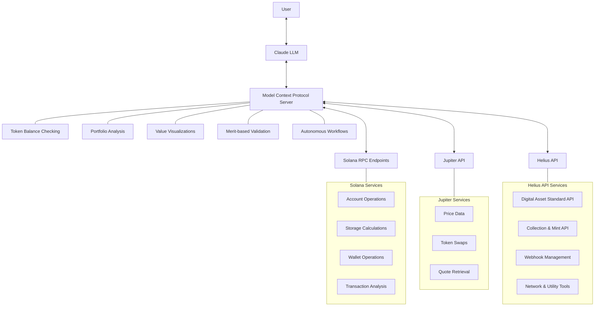

# AMOCA (Autonomous Merit On Chain Agent)

This repository demonstrates an implementation of an Autonomous Merit On Chain Agent (AMOCA) for Solana development, built on the Model Context Protocol (MCP).

[](https://smithery.ai/server/@manolaz/amoca-solana-mcp-server)
[](https://opensource.org/licenses/MIT)
[](https://solana.com)

## Table of Contents
- [AMOCA (Autonomous Merit On Chain Agent)](#amoca-autonomous-merit-on-chain-agent)
  - [Table of Contents](#table-of-contents)
  - [What is AMOCA?](#what-is-amoca)
  - [Features](#features)
  - [Solana Model Context Protocol (MCP)](#solana-model-context-protocol-mcp)
    - [What is MCP?](#what-is-mcp)
  - [Prerequisites](#prerequisites)
  - [Installation](#installation)
  - [Getting Started](#getting-started)
  - [Example Usage](#example-usage)
    - [Generate the configuration file](#generate-the-configuration-file)
    - [Using AMOCA with Claude](#using-amoca-with-claude)
  - [Project Structure](#project-structure)
  - [Ideas Extending MCP for Solana Development](#ideas-extending-mcp-for-solana-development)
    - [Ideas for Extension](#ideas-for-extension)
    - [How to Contribute](#how-to-contribute)
  - [Helius API Tools](#helius-api-tools)
    - [Digital Asset Standard (DAS) API](#digital-asset-standard-das-api)
    - [Collection \& Mint API](#collection--mint-api)
    - [Webhook Management](#webhook-management)
    - [Network \& Utility Tools](#network--utility-tools)
  - [Enhanced Prompts](#enhanced-prompts)
  - [Usage Examples](#usage-examples)
    - [Get NFTs Owned by an Address](#get-nfts-owned-by-an-address)
    - [Analyze an NFT Collection](#analyze-an-nft-collection)
    - [Monitor Network Status](#monitor-network-status)
  - [License](#license)

## What is AMOCA?

AMOCA (Autonomous Merit On Chain Agent) is an intelligent agent that provides enhanced capabilities for Solana blockchain development through a standardized interface. This implementation showcases:

1. Comprehensive RPC methods for Solana:
   - Basic account operations (getBalance, getAccountInfo, getTransaction)
   - On-chain storage calculations (getMinimumBalanceForRentExemption)
   - Wallet operations (createWallet, importWallet)

2. DeFi Trading Capabilities:
   - Token balance checking (single tokens and full portfolio analysis)
   - Token value distribution visualization with USD-based histograms
   - Portfolio value tracking with price data from Jupiter API
   - Jupiter API integration for token swaps
   - Quote retrieval and swap execution

3. Helpful autonomous workflows for Solana development:
   - Transaction analysis prompts (failure diagnosis, cost breakdown)
   - Storage cost calculations
   - Documentation access for Solana installation and clusters

4. Merit-based validation and verification of on-chain operations



## Features

- **Solana RPC Tools**: Query account information, check balances, and analyze transactions
- **Wallet Management**: Create and import Solana wallets
- **Trading Tools**: Execute token swaps, check token prices, and analyze portfolios
- **Helius API Integration**: Leverage Helius's powerful APIs for enhanced Solana data access

## Solana Model Context Protocol (MCP)

This repository demonstrates a simple implementation of a Model Context Protocol (MCP) server for Solana development.

### What is MCP?

The Model Context Protocol (MCP) is a standardized interface for AI models to interact with tools and resources. This demo showcases a simple MCP server implementation that provides:

1. Basic RPC methods for Solana (getBalance, getAccountInfo, getTransaction)
2. Some helpful prompts for Solana development

## Prerequisites

- Node.js (v16 or higher recommended)
- pnpm package manager (v9.10.0 or compatible)
- Solana CLI (optional but recommended)

## Installation

Clone this repository and install dependencies:

```bash
git clone https://github.com/manolaz/amoca-solana-mcp-server.git
cd solana-dev-mcp
pnpm install
```

To run this server in the MCP inspector, use:

```bash
npx @modelcontextprotocol/inspector ts-node index.ts
```

## Getting Started

1. **Set up environment variables**: Create a `.env` file based on the `.env.example` template with your API keys.

```bash
cp .env.example .env
# Edit .env with your API keys
```

2. **Explore the code**: The main implementation is in `index.ts`, which sets up an MCP server with simple fetching tools and some prompts.

3. **Modify the server**: You can extend the server by adding more tools, resources, and prompts.

4. **Test your implementation**: Run the test suite to ensure everything is working properly.

```bash
pnpm test
```

## Example Usage

This section explains how to use the Solana MCP server in [Claude](https://modelcontextprotocol.io/quickstart/user).
Follow the same steps to use the Solana MCP server in [Windsurf](https://docs.codeium.com/windsurf/mcp) and [Cursor](https://docs.cursor.com/context/model-context-protocol).

### Generate the configuration file

To use this Solana MCP server, you need to generate a configuration file that Claude can use to connect to the server. Run one of the following commands to generate the configuration file:

- `pnpm generate-config` if you have `ts-node` installed globally
- `pnpm build && pnpm generate-config:js` if you don't have `ts-node` installed globally

This will print a JSON config with the following content:

If you have `ts-node`:

```json
{
  "mcpServers": {
    "solana-dev": {
      "command": "ts-node",
      "args": ["<full-path-to-repo>/index.ts"]
    }
  }
}
```

If you don't have `ts-node` installed globally:

```json
{
  "mcpServers": {
    "solana-dev": {
      "command": "node",
      "args": ["<full-path-to-repo>/dist/index.js"]
    }
  }
}
```

### Using AMOCA with Claude


## Project Structure

- `index.ts` - Main server implementation
- `package.json` - Project dependencies and metadata
- `tsconfig.json` - TypeScript configuration

## Ideas Extending MCP for Solana Development

This MCP server implementation provides a foundation that you can extend or fork for your own Solana development needs. Here are some ideas to get you started:

### Ideas for Extension

1. **Priority Fee Estimator**: Add a tool that estimates optimal priority fees for Solana transactions based on recent network activity. This could help users optimize transaction costs while ensuring timely processing.

2. **Solana Verify Debugger**: Create a tool that helps debug issues with `solana-verify` by providing more detailed information about the verification process.

3. **Solana Security.txt Inspector**: Build a tool that extracts and displays the security.txt file information for a given Solana program, making it easier to contact the program's maintainers with security concerns.

4. **Squads Helper for Program Deployment**: Create a tool that automates the process of deploying and upgrading Solana programs, making it easier to manage program state across multiple environments.

5. **Anchor-Error Explainer**: Develop a tool that takes an error code and looks up the corresponding human-readable error message from the Anchor error code database.

6. **Enhanced Prompts**: Expand the server's prompt capabilities to provide more context-aware suggestions for Solana development tasks. For example, add prompts for common transaction patterns, account creation, or token operations.

7. **Transaction Builder**: Create tools that help construct complex transactions with multiple instructions, making it easier to interact with various Solana programs.

8. **Custom RPC Endpoints**: Allow configuration of custom RPC endpoints, including support for private RPC providers or local validators.

9. **Program Deployment Helpers**: Create tools that simplify the process of deploying and upgrading Solana programs.

10. **Account & Transaction Explorer**: Add a tool that takes an account or transaction ID and displays the contents in a human-readable format, similar to an explorer view. This could be useful for inspecting transaction data or account state without needing to manually decode the data.

11. **Solana, Anchor, and Protocol Documentation**: Add resources that load the Solana, Anchor, and Protocol documentation directly into the MCP editor, providing easy access to relevant information without needing to leave the editor. This could be implemented by fetching the documentation from the respective repositories and serving it as resources from the MCP server.

### How to Contribute

If you've built an extension that might be useful to others, consider submitting a pull request to this repository. Make sure to follow these guidelines:

1. Keep your code well-documented
2. Include tests for new functionality
3. Follow the existing code style
4. Update the README with information about your addition

## Helius API Tools

This project integrates various Helius API endpoints for powerful Solana data access:

### Digital Asset Standard (DAS) API

| Tool | Description |
|------|-------------|
| `getAssetsByOwner` | Get NFTs owned by a specific address |
| `getAsset` | Get detailed information about a specific NFT by its ID |
| `getAssetsByGroup` | Get assets that belong to a specific group (like collection) |
| `searchAssets` | Search for assets using complex query parameters |
| `getAssetProof` | Get the merkle proof for a compressed NFT |
| `getAssetsByCreator` | Get assets created by a specific creator address |
| `getAssetsByAuthority` | Get assets by update authority address |
| `getNftEditions` | Get all editions of a master edition NFT |

### Collection & Mint API

| Tool | Description |
|------|-------------|
| `getMintlist` | Get mintlist for a collection |

### Webhook Management

| Tool | Description |
|------|-------------|
| `getAllWebhooks` | Get all webhooks for your Helius API key |
| `getWebhookByID` | Get webhook details by webhook ID |
| `createWebhook` | Create a new webhook for address activity monitoring |
| `createCollectionWebhook` | Create a webhook to monitor NFT collections |
| `deleteWebhook` | Delete a webhook by its ID |

### Network & Utility Tools

| Tool | Description |
|------|-------------|
| `getCurrentTPS` | Get current transactions per second on Solana |
| `getTokenHolders` | Get holders of a specific token by mint address |
| `getPriorityFeeEstimate` | Get estimated priority fees for transactions |
| `getStakeAccounts` | Get stake accounts by their owner address |
| `getComputeUnits` | Simulate a transaction to get the total compute units consumed |

## Enhanced Prompts

The server includes specialized prompts for common Helius-related tasks:

| Prompt | Description |
|--------|-------------|
| `collection-analysis` | Get a detailed analysis of an NFT collection |
| `monitor-nft-collection` | Set up a webhook to monitor NFT collection activity |
| `network-status` | Get Solana network status information |

## Usage Examples

### Get NFTs Owned by an Address

```typescript
const response = await server.tools.getAssetsByOwner({
  ownerAddress: "GoodboiNft5iFNhbgKkf1RX2VdMqKvt5xYxyVh3zf9okx",
});
```

### Analyze an NFT Collection

```typescript
const response = await server.prompts["collection-analysis"]({
  collectionAddress: "J1S9H3QjnRtBbbuD4HjPV6RpRhwuk4zKbxsnCHuTgh9w",
});
```

### Monitor Network Status

```typescript
const response = await server.prompts["network-status"]({});
```

## License

MIT
